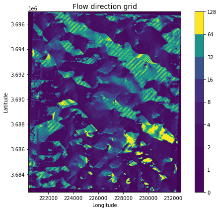
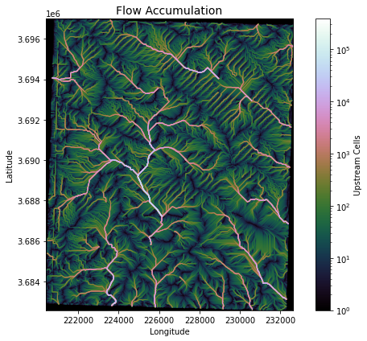
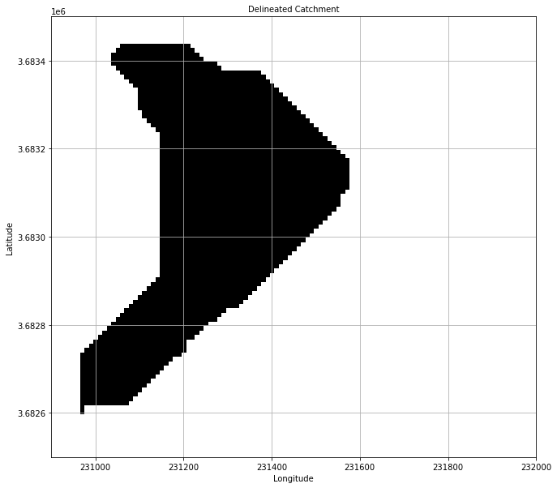
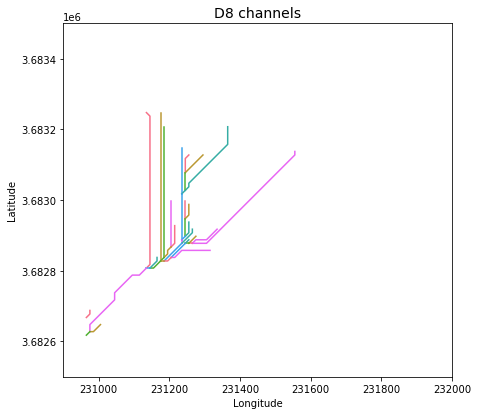
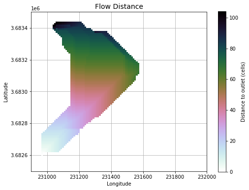

# Watershed_Delineation

# Importing Libraries

-import numpy as np
-import matplotlib.pyplot as plt
-import matplotlib.colors as colors
-import seaborn as sns
-import geopandas
-from pysheds.grid import Grid
-import mplleaflet
-%matplotlib inline

# Opening Raster File

grid = Grid.from_raster('ned10m33101c8.tif')
dem = grid.read_raster('ned10m33101c8.tif')

# Plotting Raster Image

fig, ax = plt.subplots(figsize=(10,8))
fig.patch.set_alpha(0)

plt.imshow(dem, extent=grid.extent, cmap='terrain', zorder=1)
plt.colorbar(label='Elevation (m)')
plt.grid(zorder=0)
plt.title('Digital elevation map', size=14)
plt.xlabel('Longitude')
plt.ylabel('Latitude')
plt.tight_layout()

### Conditioning DEM

# Filling pits in DEM
pit_filled_dem = grid.fill_pits(dem)

# Filling depressions in DEM
flooded_dem = grid.fill_depressions(pit_filled_dem)
    
# Resolving flats in DEM
inflated_dem = grid.resolve_flats(flooded_dem)

### Determining D8 flow directions from DEM
# Specify directional mapping
dirmap = (64, 128, 1, 2, 4, 8, 16, 32)
    
# Computing flow directions
fdir = grid.flowdir(inflated_dem, dirmap=dirmap)

# Plotting Flow

fig = plt.figure(figsize=(8,6))
fig.patch.set_alpha(0)

plt.imshow(fdir, extent=grid.extent, cmap='viridis', zorder=2)
boundaries = ([0] + sorted(list(dirmap)))
plt.colorbar(boundaries= boundaries,
             values=sorted(dirmap))
plt.xlabel('Longitude')
plt.ylabel('Latitude')
plt.title('Flow direction grid', size=14)
plt.grid(zorder=-1)
plt.tight_layout()

### Calculating flow accumulation
acc = grid.accumulation(fdir, dirmap=dirmap)

# Plotting flow accumulation
fig, ax = plt.subplots(figsize=(8,6))
fig.patch.set_alpha(0)
plt.grid('on', zorder=0)
im = ax.imshow(acc, extent=grid.extent, zorder=2,
               cmap='cubehelix',
               norm=colors.LogNorm(1, acc.max()),
               interpolation='bilinear')
plt.colorbar(im, ax=ax, label='Upstream Cells')
plt.title('Flow Accumulation', size=14)
plt.xlabel('Longitude')
plt.ylabel('Latitude')
plt.tight_layout()

# Delineating a catchment

# Specifying pour point
x, y = 225000, 3.689

# Snapping pour point to high accumulation cell
x_snap, y_snap = grid.snap_to_mask(acc > 1000, (x, y))

# Delineating the catchment
catch = grid.catchment(x=x_snap, y=y_snap, fdir=fdir, dirmap=dirmap, 
                       xytype='coordinate')

# Cropping and plotting the catchment

# Clipping the bounding box to the catchment
grid.clip_to(catch)
clipped_catch = grid.view(catch)

# Plotting the catchment
fig, ax = plt.subplots(figsize=(12,10))
fig.patch.set_alpha(0)

plt.grid('on', zorder=0)
im = ax.imshow(np.where(clipped_catch, clipped_catch, np.nan), extent=grid.extent,
               zorder=1, cmap='Greys_r')
plt.xlabel('Longitude')
plt.ylabel('Latitude')
plt.xlim(230900, 232000)
plt.ylim(3.6825*1e6, 3.6835*1e6)
plt.title('Delineated Catchment', size=10)

# Extracting river network
branches = grid.extract_river_network(fdir, acc > 50, dirmap=dirmap)

# Plotting with river network

sns.set_palette('husl')
fig, ax = plt.subplots(figsize=(8.5,6.5))

plt.xlim(grid.bbox[0], grid.bbox[2])
plt.ylim(grid.bbox[1], grid.bbox[3])
ax.set_aspect('equal')

for branch in branches['features']:
    line = np.asarray(branch['geometry']['coordinates'])
    plt.plot(line[:, 0], line[:, 1])
    
_ = plt.title('D8 channels', size=14)
_ = plt.xlabel('Longitude')
_ = plt.ylabel('Latitude')
_ = plt.xlim(230900, 232000)
_ = plt.ylim(3.6825*1e6, 3.6835*1e6)

# Calculating distance to outlet from each cell

dist = grid.distance_to_outlet(x=x_snap, y=y_snap, fdir=fdir, dirmap=dirmap,
                               xytype='coordinate')

# Plotting the distances to the outlet

fig, ax = plt.subplots(figsize=(8,6))
fig.patch.set_alpha(0)
plt.grid('on', zorder=0)
im = ax.imshow(dist, extent=grid.extent, zorder=2, cmap='cubehelix_r')
plt.colorbar(im, ax=ax, label='Distance to outlet (cells)')
plt.xlabel('Longitude')
plt.ylabel('Latitude')
plt.xlim(230900, 232000)
plt.ylim(3.6825*1e6, 3.6835*1e6)
plt.title('Flow Distance', size=14)

